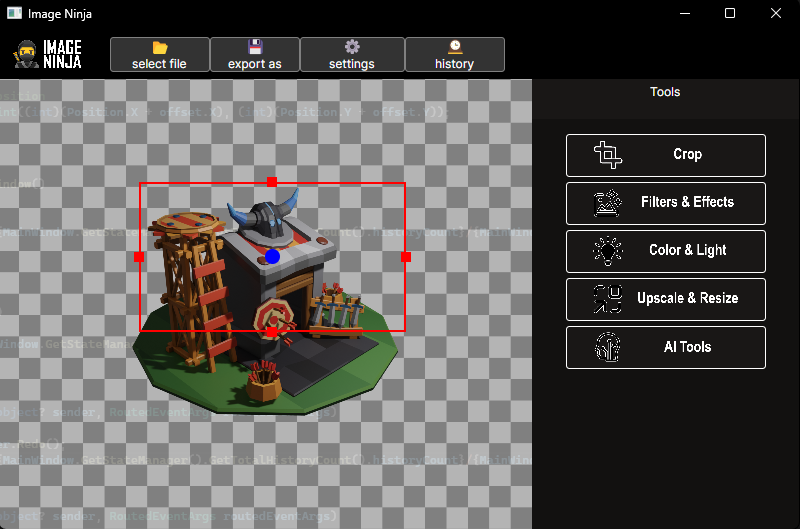
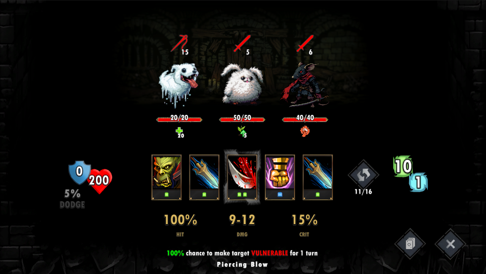
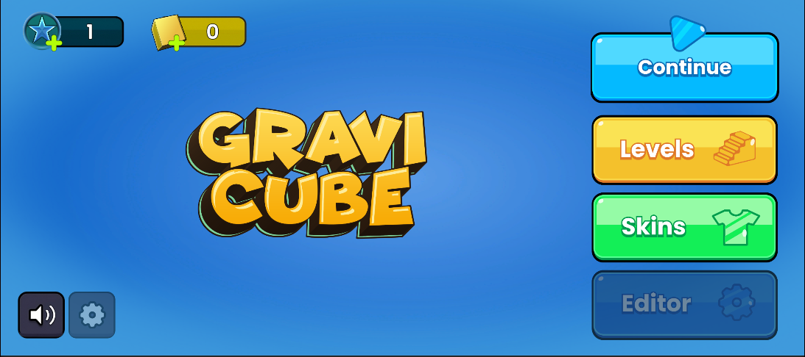
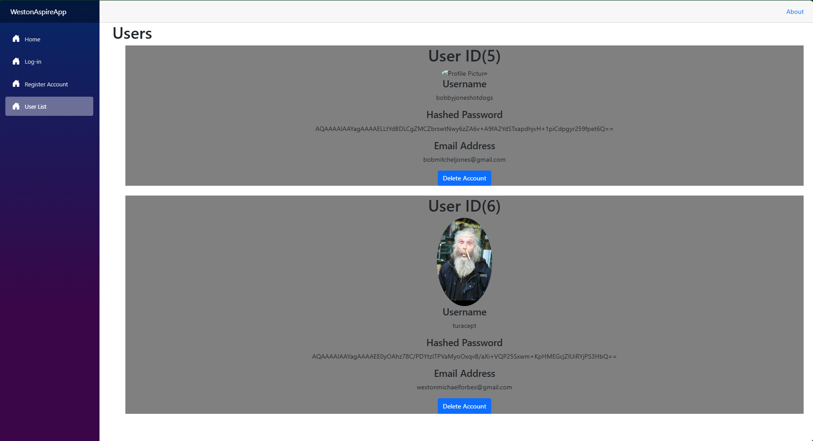

## Hi there 👋
### I'm Weston, and I've been on GitHub for 10 years now! ⚡

I've explored a wide array of projects over the years, ranging from Web and Software development to APIs, Mobile apps, Libraries, and beyond.

### 🔧 My Specializations
My primary expertise lies in **Game Development with Unity**, which has been my focus since joining GitHub. I also offer contract Game Development services—feel free to reach out at [weston@techsake.ca](mailto:weston@techsake.ca).

As the Lead Developer and Founder of **TechSake**, I created this group to find a collective in the vast world of computer science. Although I've often developed in solitude, I'm now embracing collaboration and learning from others, particularly as I dive deeper into web development.

Over the past year, I've significantly expanded my web development skills. A year ago, I was just getting to grips with React and static web pages; now, I’ve successfully developed a custom social media web application, thanks in large part to the .NET Aspire toolset.

### 🛠️ Technologies & Skill Levels

- **C#**  
    
  Advanced – Projects: [Project 1](#), [Project 2](#)
  
- **Java**  
    
  Intermediate – Projects: [Project 1](#), [Project 2](#)

- **HTML/CSS**  
    
  Advanced – Projects: [Project 1](#), [Project 2](#)
  
- **JavaScript/TypeScript**  
    
  Proficient – Projects: [Project 1](#), [Project 2](#)

- **Python**  
    
  Proficient – Projects: [Project 1](#)
  
- **Lua**  
    
  Novice – Projects: [Project 1](#)
  
- **Dart (Flutter)**  
    
  Novice – Projects: [Project 1](#)

## 📸 Projects Showcase

### 1. Social Tab Interface

A snapshot from one of my Unity projects showcasing the social interaction interface. This screen allows players to manage their friends and incoming requests in a clean, user-friendly layout.

---

### 2. Base Building Interface

This is the base building interface where players can manage and upgrade their structures. The clean UI makes it easy for players to navigate through different building options.

---

### 3. Image Ninja - Image Editing Tool

An image editing software I developed called "Image Ninja," which allows users to crop, apply filters, adjust colors, and even upscale images with AI tools. The intuitive UI ensures a smooth user experience.

---

### 4. RPG Battle Interface

A dark-themed battle interface for an RPG game I'm developing. It features a strategic combat system where players can manage their skills and abilities against enemies.

---

### 5. GraviCube Game Menu

The main menu for my game "GraviCube," offering options to continue, select levels, choose skins, and access the editor. The vibrant colors and clean layout ensure an engaging user experience.

---

### 6. GraviCube Level Selection

The level selection screen in "GraviCube," featuring a clear and simple design for navigating different stages of the game.

---

### 7. Inventory System in RPG

An inventory system interface from an RPG game, displaying various equipment slots and items available in the store. The design emphasizes clarity and ease of use.

---

### 8. User List Interface in Web Application

A user management interface from a web application I built. This page allows admins to view and manage user accounts efficiently, with options to delete accounts directly from the UI.

 <!--
**turacept/turacept** is a ✨ _special_ ✨ repository because its `README.md` (this file) appears on your GitHub profile.

Here are some ideas to get you started:

--🔭 I’m currently working on ...
- 🌱 I’m currently learning ...
- 👯 I’m looking to collaborate on ...
- 🤔 I’m looking for help with ...
- 💬 Ask me about ...
- 📫 How to reach me: ...
- 😄 Pronouns: ...
- ⚡ Fun fact: ...
-->
